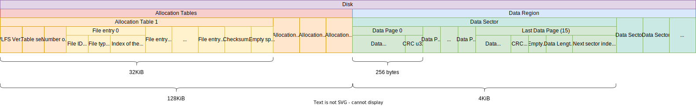

# VLFS

> Async Embedded FS for Rust

# Features

- `#[no_std]` support
- No allocation
- Power-loss resilience: at most 252 bytes of unflushed data will be lost (see TODO)
- Dynamic wear leveling
- Bounded RAM/ROM
- Bounded execution time
- Async
- Data corruption detection / recovery

# Overview

VLFS is based on a file allocation table design and uses linklists to store data. Every file is indexed by a `u64` file id and a `u16` file type. The file id is automatically generated when creating a new file, and it is self incrementing. To use VLFS, you need a flash that implements the [`Flash`](./src/driver/flash.rs) trait and a crc implementation that implments the [`Crc`](./src/driver/crc.rs) trait.

# Example

- [Flash and CRC implementation](https://gist.github.com/PegasisForever/e3ece967100eae4870c550a751886b67)
- [VLFS Usage](https://github.com/McMaster-Rocketry-Team/rust-monorepo/blob/92613b85c1826f4ef27d66bb3ff2f102b9ff49c2/firmware-common/src/common/console/console.rs#L104)

# Benchmark

NOR flash (W25Q512JV) on 16MHz SPI bus:

- Average sequential write speed: 121KiB/s
  - 64 bytes writing time:
    - mean: 0.5ms
    - max: 2.5ms
- Average sequential read speed: 597KiB/s

# Notes

- To change the maximum supported flash size, update `SECTORS_COUNT` in [./src/fs/mod.rs](./src/fs/mod.rs). Reducing sectors count reduces the  required memory.
- Flash's erase methods must set all the erased bits to 1 - VLFS relies on this assuption.
- CRC implementations must not produce 0xFFFF for [0u32; 252] or [0u32; 236] - VLFS relies on this assuption. // TODO check again
- If CRC functionalities is not desired, a CRC implementation that always produces 0 can be used.

# Disk Layout

Note: Multiple allocation tables are used for wear-leveling purpose.

# Todo

- Replace file write queue with fair rwlock (caller can't get error after the data is in queue)
- Power loss resilience when initiating append to an existing file (I think this is the only case where a power loss will corrupt flushed data)
- Error handling for `find_most_common_u16_out_of_4`
- `create_file_and_open` method

# Long-term Todo

- Use constant generics to support different sizes of flash (tried it before but crashed the compiler)
- Host application for creating / reading VLFS images
- Use driver traits from `async_embedded_traits`
